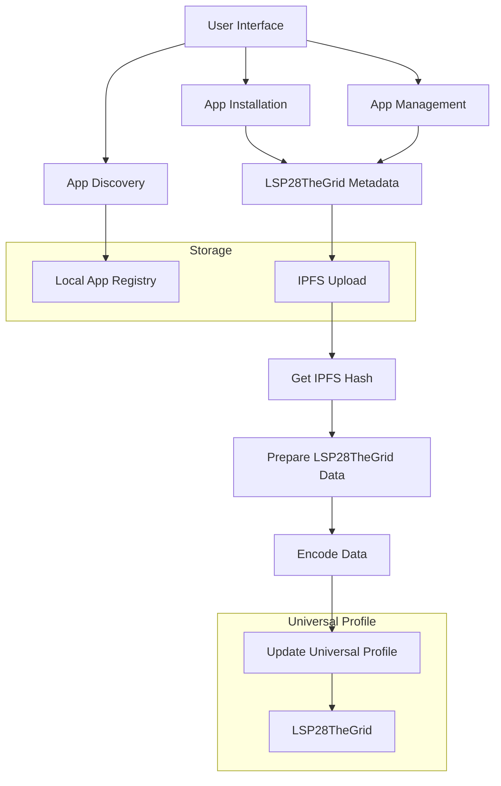

# Mini Store - Your Universal Profile App Discovery Platform

Mini Store is a decentralized app discovery platform built for the LUKSO ecosystem, designed to make it easy for users to find, install, and manage Universal Profile mini-apps. Think of it as the "App Store" for the LUKSO ecosystem, but with a focus on decentralization and user sovereignty.

## 🌟 Key Features

### For Users
- **Seamless Discovery**: Browse apps by category, popularity, or search
- **One-Click Installation**: Install apps directly to your Universal Profile grid
- **Curated Experience**: Featured apps and top charts help you find the best apps
- **Developer Verification**: Trusted developers are highlighted
- **Rich App Details**: Screenshots, descriptions, and size information for each app
- **My Apps Management**: View and manage all your installed apps in one place

### For Developers
- **Easy Integration**: Simple process to list your mini-app
- **Rich Metadata**: Support for app icons, banners, screenshots, and descriptions
- **Category System**: Organize your app for better discovery
- **Developer Profiles**: Build your reputation in the ecosystem
- **Direct Distribution**: Reach users directly through their Universal Profiles

## 🚀 Value Proposition

### For the LUKSO Ecosystem
1. **Ecosystem Growth**: Makes it easier for users to discover and use LUKSO apps
2. **Developer Onboarding**: Simplifies the process for developers to reach users
3. **Quality Control**: Curated experience ensures high-quality apps
4. **User Experience**: Streamlined discovery and installation process

### For Users
1. **Centralized Discovery**: One place to find all LUKSO mini-apps
2. **Trust & Safety**: Verified developers and curated content
3. **Easy Management**: Install and manage apps directly from your Universal Profile
4. **Rich Information**: Detailed app information before installation
5. **Personalized Experience**: Apps organized by category and popularity

### For Developers
1. **Distribution Channel**: Reach users directly through their Universal Profiles
2. **Marketing Platform**: Showcase your app with rich media
3. **User Acquisition**: Get discovered by users browsing for apps
4. **Analytics**: Track installations and usage
5. **Community Building**: Build a following in the LUKSO ecosystem

## 🔮 Future Improvements

### Technical Enhancements
1. **Decentralized Registry**
   - Implement a more efficient backend service for storing mini-app metadata
   - Use IPFS for decentralized storage of app data

2. **Enhanced Security**
   - Implement LSP6 KeyManager to abstract away transactions
   - Implement reputation system for developers

3. **Smart Discovery**
   - Add context-aware app suggestions based on user behavior
   - Create personalized app feeds

4. **Developer Tools**
   - Add analytics dashboard for developers
   - Implement app update management
   - Add developer documentation and SDK

5. **User Experience**
   - Add app ratings and reviews
   - Add app search with filters
   - Create app collections and playlists

### Ecosystem Integration

1. **Community Features**
   - Add user reviews and ratings
   - Implement app discussions and comments

2. **Monetization**
   - Add support for in-app purchases
   - Implement app subscriptions (o_O)

## 🛠️ Technical Stack

- **Frontend**: Next.js 14
- **Styling**: Tailwind CSS
- **Blockchain**: viem
- **Universal Profile**: UP Provider
- **Data Schemas**: ERC725.js
- **Data Fetching**: Apollo Client
- **IPFS**: Pinata API
- **State Management**: React Context

## 📐 Architecture



### Flow Description

1. **User Interface Layer**
   - App discovery through categories and search
   - Installation/uninstallation interface
   - App management dashboard

2. **Data Layer**
   - Local app registry (demo phase)
   - IPFS storage for metadata
   - Universal Profile LSP28TheGrid data

3. **Process Flow**
   - User selects app to install/uninstall
   - System prepares LSP28TheGrid metadata
   - Metadata is uploaded to IPFS
   - IPFS hash is retrieved
   - Final LSP28TheGrid data is prepared and encoded
   - Universal Profile is updated with new grid data

4. **Integration Points**
   - Universal Profile Provider for blockchain interaction
   - IPFS (Pinata) for decentralized storage
   - Local registry for app metadata (to be decentralized in future)

## 🚀 Getting Started

1. Clone the repository:
```bash
git clone https://github.com/Deliquified/mini-store.git
cd mini-store
```

2. Install dependencies:
```bash
npm install
```

3. Create a `.env` file:
```env
PINATA_API_KEY=your_pinata_api_key
PINATA_API_SECRET=your_pinata_api_secret
```

4. Start the development server:
```bash
npm run dev
```

## 🤝 Contributing

We welcome contributions! Please see our [Contributing Guide](CONTRIBUTING.md) for details.

## 📝 License

[MIT License](LICENSE)

Made with ❤️ by Deliquified Labs
